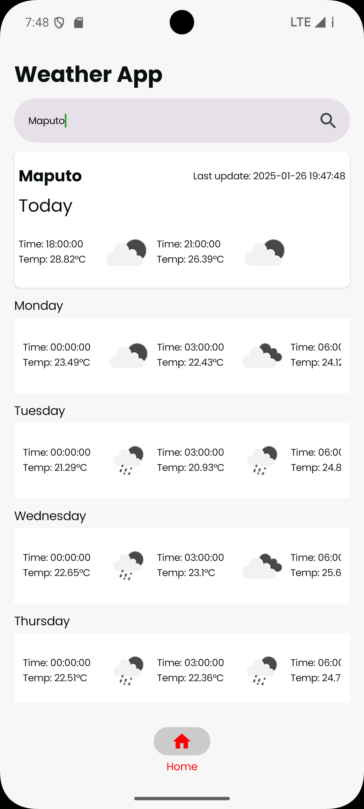
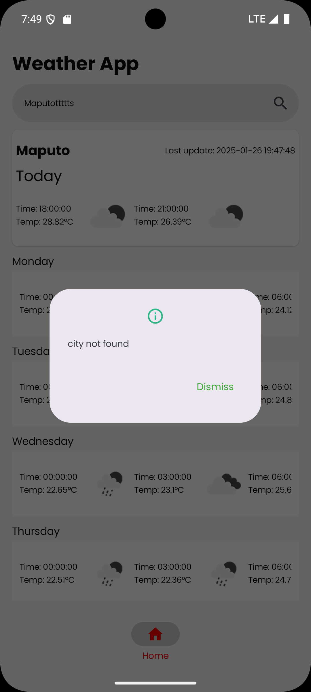
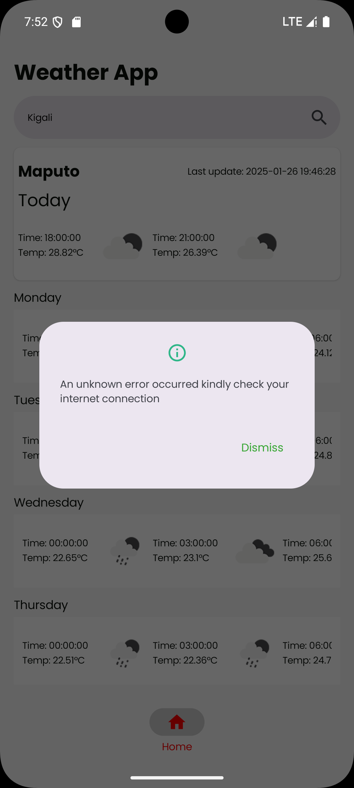
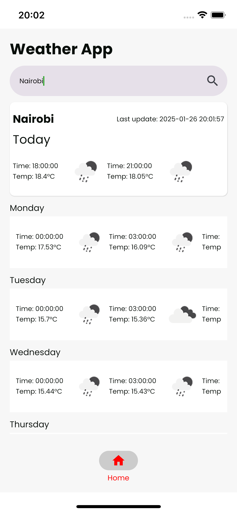
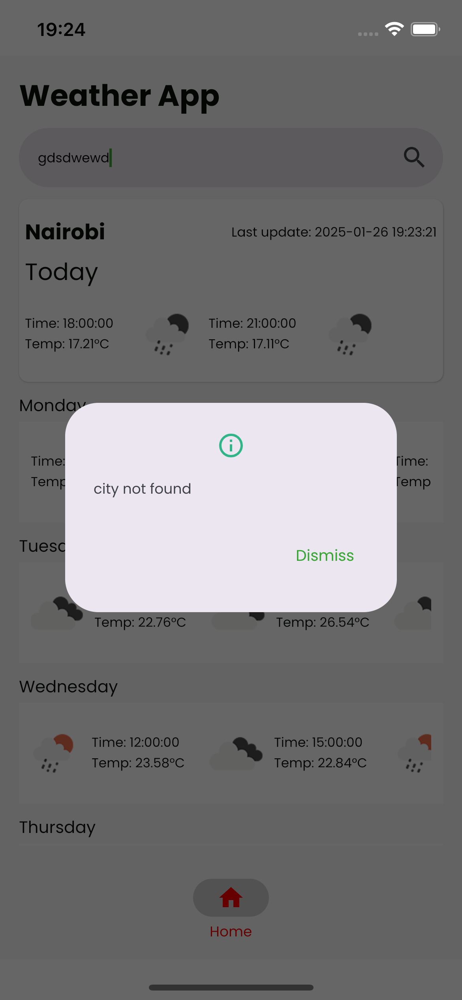
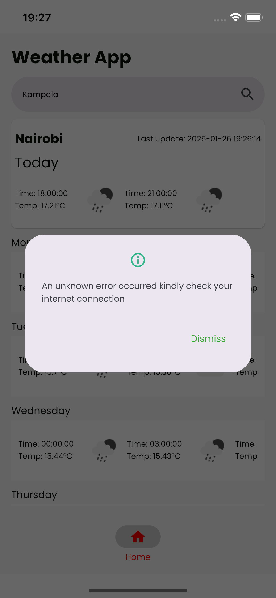

# Project Dependencies & Configuration

## Android Configuration
- **AGP (Android Gradle Plugin)**: `8.5.2`  
  _Plugin for building Android apps with Gradle._
- **Android Compile SDK**: `34`  
  _The Android version used for compiling the app._
- **Android Min SDK**: `28`  
  _Minimum Android version required to run the app._
- **Android Target SDK**: `34`  
  _Target Android version for the app to run on._

## Android Libraries
- **androidx-activityCompose**: `1.9.3`  
  _Integration of Jetpack Compose with Android Activity lifecycle._
- **androidx-appcompat**: `1.7.0`  
  _Support for Material Design and backward compatibility for UI components._
- **androidx-constraintlayout**: `2.2.0`  
  _Flexible layout manager for building complex layouts._
- **androidx-core-ktx**: `1.15.0`  
  _Kotlin extensions for Android Core libraries._
- **androidx-espresso-core**: `3.6.1`  
  _UI testing framework for Android._
- **androidx-lifecycle**: `2.8.4`  
  _Android Lifecycle components for managing UI-related data lifecycle-aware._
- **androidx-material**: `1.12.0`  
  _Material Design components for Android._
- **androidx-test-junit**: `1.2.1`  
  _JUnit support for Android testing._

## Kotlin & Compose Multiplatform
- **Compose Multiplatform**: `1.7.0`  
  _Cross-platform UI framework for building native applications._
- **Kotlin**: `2.1.0`  
  _The Kotlin programming language used for the project._

## Testing & Libraries
- **JUnit**: `4.13.2`  
  _Testing framework for Java/Kotlin applications._
- **androidx-uiTest**: `1.7.5`  
  _UI testing for Jetpack Compose._

## Additional Dependencies
- **BigNum**: `0.3.9`  
  _Library for working with arbitrary-precision numbers._
- **Kamel Image**: `1.0.1`  
  _Image loading library for Jetpack Compose((usage-cache weather icons))._
- **Koin Annotations**: `1.3.1`  
  _Koin annotations for dependency injection in Kotlin._
- **Lifecycle ViewModel Compose**: `2.8.4`  
  _Jetpack Compose integration with ViewModel and LiveData._
- **Voyager**: `1.1.0-beta03`  
  _Navigation library for Jetpack Compose._
- **Napier**: `2.7.1`  
  _Logging library for Kotlin and Jetpack Compose._
- **Build Config**: `5.3.5`  
  _Build-time configuration management for Android._

## Kotlinx Libraries
- **kotlinx-coroutines**: `1.9.0`  
  _Kotlin library for asynchronous programming using coroutines._
- **ktor**: `3.0.1`  
  _Kotlin framework for building server and client  applications._
- **kotlinx-serialization**: `1.7.3`  
  _Kotlin serialization library for encoding/decoding data formats like JSON._
- **kotlinx-datetime**: `0.6.1`  
  _Kotlin extension library for working with date and time._

## Database & Utilities
- **SQLDelight**: `2.0.2`  
  _Kotlin Multiplatform SQL library for working with databases(used to cache weather data)._
- **Size Measurement**: `0.5.0`  
  _Library for measuring UI element sizes(to adapt to different screens)._
- **Coil 3**: `3.0.0-alpha08`  
  _Image loading library for Jetpack Compose, with support for modern image formats(usage-cache weather icons)._

##Preview
### Android

    <!-- Top row of images -->
    

        
        
          
    

### iOS

    <!-- Top row of images -->
    

        
        
        
    

## Running the Project

### Android
1. **Open Android Studio**.
2. **Open the project** as a whole and **and not  the `android` module directly** to see all configurations.
3. In **Android Studio**, choose the **composeApp** from the run configurations drop-down.
4. Click the **Build** button to run the project on real device or emulator.

### iOS
1. Navigate to the `iosApp` folder inside the project.
2. Open the `iosApp.xcworkspace` file in **Xcode**.
3. In Xcode, select your **Development Team** under the **Signing & Capabilities** tab in the project settings.
4. Select the target device or simulator.
5. Click the **Build** button in Xcode to compile and run the app on the iOS simulator or device.

6. **Return to Android Studio**.
7. Select the **iosApp** target from the run configurations drop-down.
8. Click the **Build** button in Android Studio to compile the project and deploy the app to the iOS simulator or device.

## Approach
I leveraged the power of Kotlin Multiplatform to build a unified solution that runs seamlessly across all platforms, including Android, iOS, and others. On Android, the app runs natively using Kotlin, taking full advantage of Kotlin’s features for performance and security. For iOS, I used Kotlin Multiplatform to share common business logic and manage platform-specific implementations, enabling the app to run on iOS devices while utilizing Compose UI for the user interface. This allowed me to maintain a consistent UI codebase across both Android and iOS, while also integrating platform-specific APIs and libraries. In some cases, I used Swift for iOS-specific features, leveraging Swift’s strengths for optimal integration with the iOS ecosystem, all while using Kotlin’s expect/actual mechanism for shared logic.

By sharing core business logic between platforms, I was able to reduce duplication, ensuring consistent behavior and easy maintenance.

To optimize performance, I implemented a robust caching mechanism. Weather data is stored locally, allowing the app to function smoothly even when offline. When network connectivity is available, the app intelligently updates the cached data with the latest weather information, ensuring users always receive fresh data.

Kotlin was used throughout the project, enabling both shared logic and platform-specific implementations. This approach maximized code reuse while ensuring that each platform's unique features and performance requirements were properly addressed, resulting in an optimized and secure app experience across all devices.

## Challanges faced
While integrating the  API, I encountered a problem where the shared API endpoint was pointing to a HTTP URL:
Enabling HTTP is generally **not recommended** as it compromises security-Can be enabled in android manifest

### Solution
After some research, I discovered that the same API was accessible via an HTTPS endpoint, and using the HTTPS version resolved the issue.
I used the same provided  API key provided in the task , and the request worked as expected.

